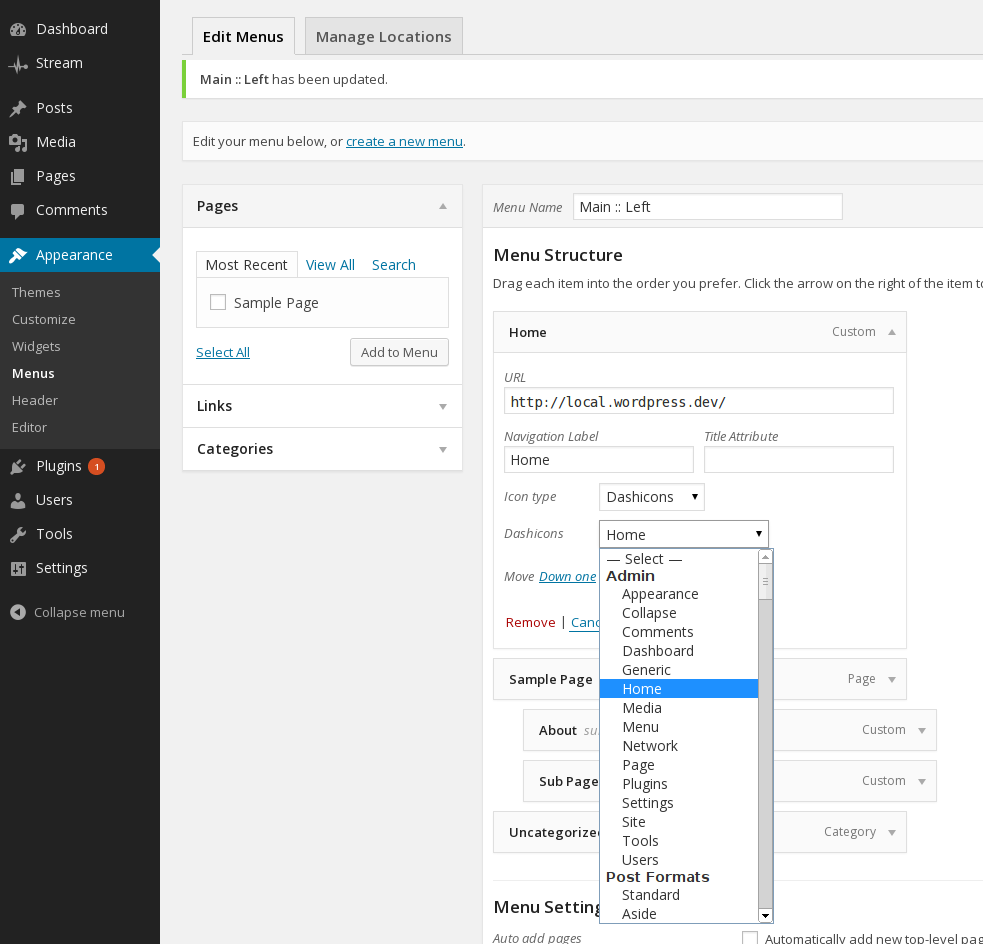
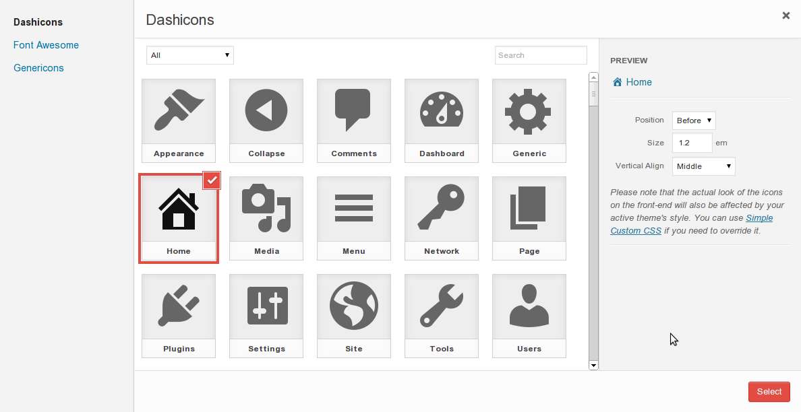
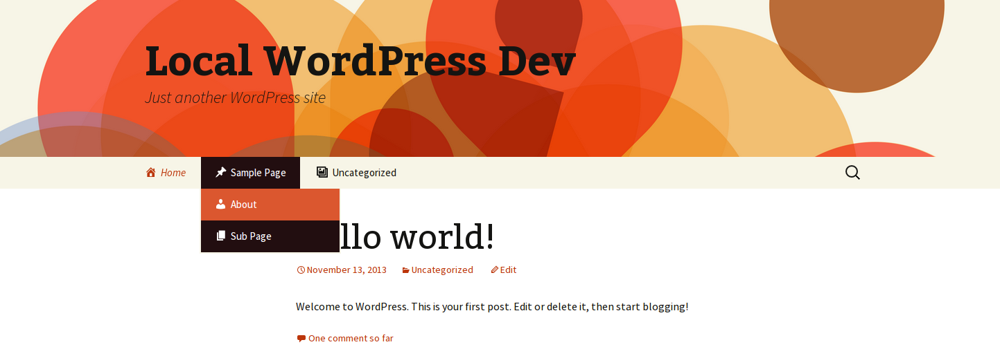

<!-- DO NOT EDIT THIS FILE; it is auto-generated from readme.txt -->
# Menu Icons

Easily add icons to your nav menu items.

**Contributors:** [kucrut](http://profiles.wordpress.org/kucrut)  
**Tags:** [menu](http://wordpress.org/plugins/tags/menu), [nav-menu](http://wordpress.org/plugins/tags/nav-menu), [icons](http://wordpress.org/plugins/tags/icons), [navigation](http://wordpress.org/plugins/tags/navigation)  
**Requires at least:** 3.8  
**Tested up to:** 3.8.1  
**Stable tag:** 0.1.2  
**License:** [GPLv2](http://www.gnu.org/licenses/gpl-2.0.html)  
**Donate Link:** http://kucrut.org/#coffee  

## Description ##

### Usage ###
1. After the plugin is activated, go to *Appearance* > *Menus* to edit your menus
1. Each menu item will now have new *Icon Type* selection field with their corresponding sub-fields
1. Select the desired icon type
1. Select the icon from the second drop-down
1. Save the menu

### Currently supported icon types ###
- Dashicons (WordPress core icon fonts)
- [Genericons](http://genericons.com/) by [Automattic](http://automattic.com/)

### Planned supported icon types ###
- [Font awesome](http://fortawesome.github.io/Font-Awesome/)
- Image (attachment file & URL)

### Planned features ###
1. Provide modal popup that displays the icons for selection
2. Theme customizer support

See **Other Notes** to know about the *hidden* features.

Development of this plugin is done on [GitHub](https://github.com/kucrut/wp-menu-icons). **Pull requests welcome**. Please see [issues reported](https://github.com/kucrut/wp-menu-icons/issues) there before going to the plugin forum.


## Screenshots ##

### Icon selection



### Twenty Fourteen with Dashicons



### Twenty Fourteen with Genericons


### Twenty Thirteen with Dashicons



### Twenty Thirteen with Genericons


## Installation ##

1. Upload `menu-icons` to the `/wp-content/plugins/` directory
1. Activate the plugin through the *Plugins* menu in WordPress

## Frequently Asked Questions ##

### The icons are now showing! ###
Make sure that your active theme is using the default walker for displaying the nav menu. If it's using its own custom walker, make sure that the menu item titles are filterable (please consult your theme author about this).

### The icon positions don't look right ###
If you're comfortable with editing your theme stylesheet, then you can override the styles from there.
Otherwise, I recommend you to use the [Simple Custom CSS plugin](http://wordpress.org/plugins/simple-custom-css/)

### Is this plugin extendable? ###
**Certainly!**

Here's how you can remove an icon type from your plugin/theme:
```php
function myplugin_remove_menu_icons_type( $types ) {
	unset( $types['genericon'] );
	return $types;
}
add_filter( 'menu_icons_types', 'myplugin_remove_menu_icons_type' );
```

To add a new icon type, take a look at the `type-*.php` files inside the `includes` directory of this plugin.

### Can you please add X icon font? ###
Let me know via [GitHub issues](https://github.com/kucrut/wp-menu-icons/issues) and I'll see what I can do.


## Other Notes ##

### Extra Stylesheet ###
By default, this plugin loads an extra stylesheet to make the icons display nicely on the menus.
If you don't desire this and would like your theme/plugin to handle it instead, simply do the following:
```php
add_filter( 'menu_icons_load_extra_style', '__return_false' );
```


## Changelog ##

### 0.1.2 ###
* Improve extra stylesheet

### 0.1.1 ###
* Improve icon selection UX

### 0.1.0 ###
* Initial public release


